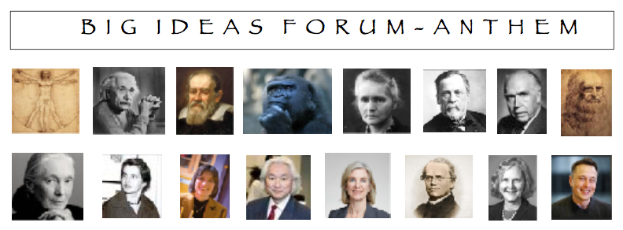

# **Big Ideas Forum** - Anthem

Where do you go to hear about, discuss, and answer questions like: 

* Can we change our genes to live past 150 and still be healthy? 
* Will robots take our jobs away?
* Can we accelerate children's eduction via a digital tutor and virtual reality?
* Is it possible to boost your knowledge by uploading information to your brain?
* Will money disappear? Will cryptocurrency replace banks?
* Can we completely eliminate our electricity bill?

The **Big Ideas Forum** is an informal group of inquisitive people of all ages, backgrounds and experiences who wants to explore, understand, and debate the impact on our lives of some of the technological challenges we face in years to come.

---

Science and technology  gather knowledge faster than society gathers wisdom. Every day we are amazed by new discoveries, by boundaries being push out farther and farther, by how things around us are getting faster, smaller, smarter and more connected; we don’t know how to keep up - or worse, we cannot make sense of what it means for our daily lives. And this is only the beginning.

To address some of the above questions, **Big Ideas Forum** was formed, first in collaboration with the local library at Boulder Creek High School and later with the Anthem Community Center. The focus was to have a place where people can learn about and discuss how societies will be transformed and our lives will be impacted by technologies like robotics, artificial intelligence, driverless cars, wearable electronics, gene therapy, extended lifespans, and memory enhancement. The development in all these fields is unstoppable and already well underway, and it will only go faster in the future. Ten to fifteen years from now, the world will be radically different from what we know today. 

Equally important: We are, by and large, totally unprepared to face these changes. Because of the deep impact of these technologies on society, we must all become knowledgeable about them and the opportunities, challenges and risks, and ethical questions that lie on the horizon. 

Hence this forum.

---

**Big Ideas Forum** meetings are free. As participants discuss the issues long after leaving an event, everyone should consider bringing a friend, a neighbor, a colleague, anyone - including young people; it’s after all their future that’s on the agenda.
